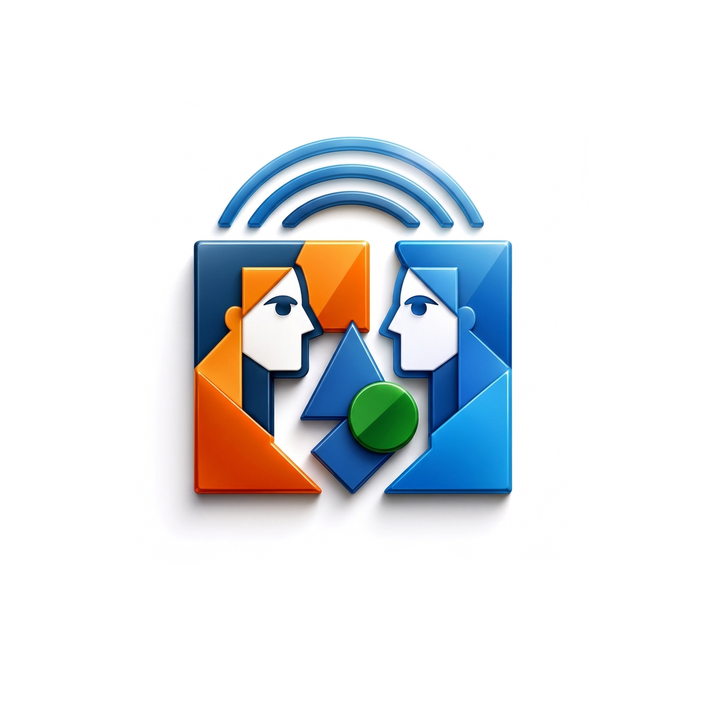
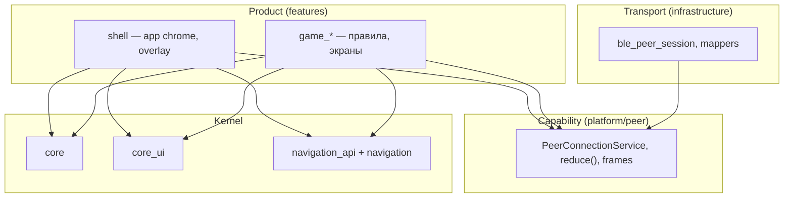
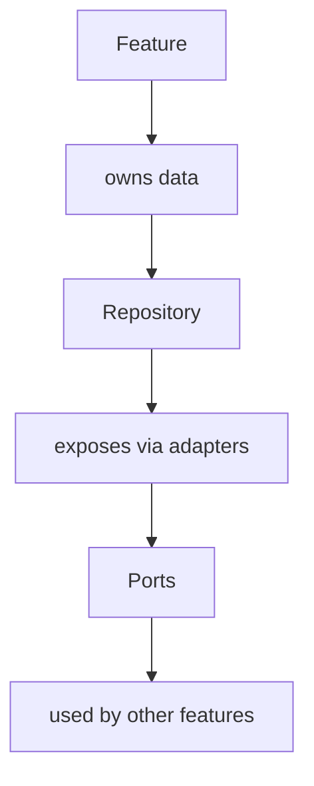
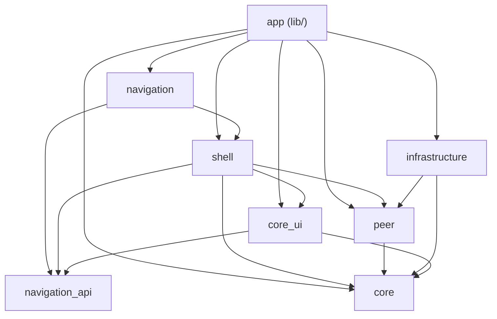
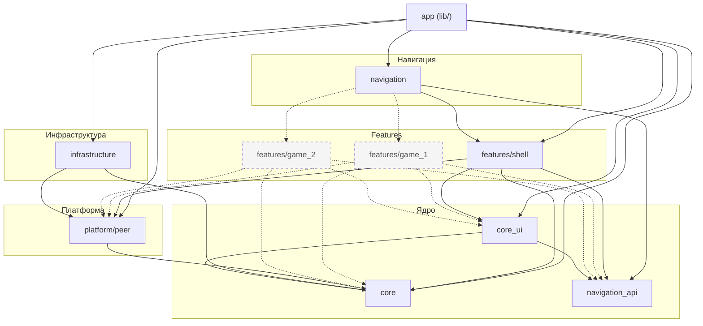

# tete games



Мобильное приложение для офлайн-игр на двоих по Bluetooth Low Energy (BLE).  
Два устройства находят друг друга, устанавливают соединение и обмениваются игровыми сообщениями — без интернета.

## О проекте

Поддерживаются пары Android↔Android, iOS↔iOS и Android↔iOS.

Текущее состояние:

- BLE-транспорт (`ble_peer_session`): роли host/client, discovery, flow подключения;
- app shell: splash, home (host/client), заглушка списка игр;
- игровая логика и кодеки peer-сообщений — в планах (крестики-нолики и др.).

Стек приложения:

- **архитектура** — Lean Hexagonal Feature Architecture (LHFA); канон — `.kb/architecture/`;
- **состояние** — `flutter_bloc` + effect-based навигация и UI-эффекты;
- **DI** — `injectable` + `get_it` (`appLocator`); Composition Root — `lib/di/app_di.dart`;
- **UI** — тема, цвета и компоненты из `core_ui` (`AppScaffold`, `ui_kit`).

## Статус

| Область | Статус |
|---------|--------|
| Workspace & DI | готово |
| Тема и ui_kit (`core_ui`) | готово |
| BLE-транспорт (`infrastructure/peer`, `ble_peer_session`) | готово |
| Splash / Home / список игр | готово |
| Firebase bootstrap (Crashlytics) | готово (нативная конфигурация + Dart init) |
| Игры (`features/game_*`) | в планах |
| Stress test (2–3 независимые игры) | в планах |

## Архитектура

Канон: [`.kb/architecture/`](.kb/architecture/README.md). Кратко — **Lean Hexagonal Feature Architecture**: ownership вокруг feature, межфичевое — через StatePort/EventPort, не через import.

### Структура workspace

```text
lib/di/app_di.dart          Composition Root (единственное место сборки графа DI)
.kb/architecture/           Архитектурный канон (README, ADR, anti-patterns)
core/                       BLoC-хелперы, локализация, технические порты
core_ui/                    тема, ui_kit
navigation_api/             порт AppNavigator
navigation/                 AppRouter — агрегатор маршрутов shell + игр
infrastructure/             SharedPreferences, Firebase Crashlytics, BLE wire transport
platform/peer/              BLE FSM, frames, PeerConnectionService
features/shell/             splash, home, profile/settings, BLE overlay UI
features/<game_name>/       отдельная игра (domain + presentation + DI)
```

### Продукт и транспорт

| Слой | Содержание |
|------|------------|
| **Продукт** | Offline peer-to-peer игры на двух устройствах (shell + `features/game_*`) |
| **Capability** | `platform/peer` — соединение, FSM, frames; не знает о правилах игр |
| **Транспорт** | BLE wire в `infrastructure/lib/src/peer/` (`ble_peer_session`, mappers) |

Архитектура описана transport-агностично; BLE — контекст продукта, не определение архитектуры.

### Conceptual ownership



Feature владеет своими данными (Repository). Межфичевое — StatePort/EventPort у consumer; wiring — `lib/di/*_port_adapters.dart`.



### Жизненный цикл данных

**Чтение:**

```text
Transport → Transport Model → Repository → Domain → BLoC → Widget
```

**Запись:**

```text
Widget → BLoC → Repository → Transport Model → Transport
```

Маппинг Transport Model → Domain **только** в Repository.

### Граф зависимостей (текущий)



### Расширение: игровые feature-пакеты



Пунктир — планируемые игры. Сплошные стрелки — существующие зависимости.

### Правила для игровых пакетов

| Разрешено | Запрещено |
|-----------|-----------|
| `core`, `core_ui`, `navigation_api` | `infrastructure`, корневой `app` |
| `platform/peer` (barrel `peer_connection`, `peer_game`) | import других `features/*` |
| свой `domain` + `presentation` + injectable DI | прямой импорт `ble_peer_session` |
| регистрация маршрутов в `AppRouter` | зависимость `peer` → игра |

Типичный flow добавления игры:

1. `mason make feature_package --feature_name game_1` → `features/game_1/`.
2. Экран игры + BLoC; обмен ходами через `PeerConnectionService` / `peer_game.dart`.
3. Подключить пакет в workspace (`pubspec.yaml`), `navigation`, DI (`lib/di/app_di.dart`).
4. Добавить `AutoRoute` в `AppRouter` и пункт в grid на Home.

### Anti-patterns

См. [`.kb/architecture/09-anti-patterns.md`](.kb/architecture/09-anti-patterns.md): feature→feature, AppEventBus, SDK в feature, platform→game logic.

Граф зависимостей проверяется в CI: `fvm dart run tool/check_workspace_graph.dart` (`strict: true`).

## Пакеты workspace

| Пакет | Назначение |
|-------|------------|
| `core/` | `appLocator`, BLoC-хелперы, локализация, технические порты |
| `infrastructure/` | SharedPreferences, Firebase Crashlytics, BLE transport (`ble_peer_session`) |
| `core_ui/` | тема (`AppTheme`, `AppColors`), `AppScaffold`, `ui_kit` |
| `platform/peer/` | BLE connection FSM, frames, `PeerConnectionService` |
| `navigation_api/` | порт `AppNavigator` |
| `navigation/` | `AppRouter` (реализует `AppNavigator`, агрегирует маршруты) |
| `features/shell/` | splash, home, profile/settings, список игр, BLE connection UI |
| `features/game_*` | отдельная игра — свой domain, экран(ы), DI *(планируется)* |

## Стек

- Flutter 3.41+ / Dart 3.11+
- Bluetooth Low Energy (BLE) через `ble_peer_session`
- `flutter_bloc` + `bloc_concurrency`
- `freezed`, `injectable`, `auto_route`
- `firebase_core`, `firebase_crashlytics`
- FVM для фиксации версии SDK

## Быстрый старт

```bash
fvm flutter pub get
fvm dart run build_runner build --delete-conflicting-outputs
fvm flutter run
```

## Сборка

```bash
fvm flutter build apk
fvm flutter build ios
```
