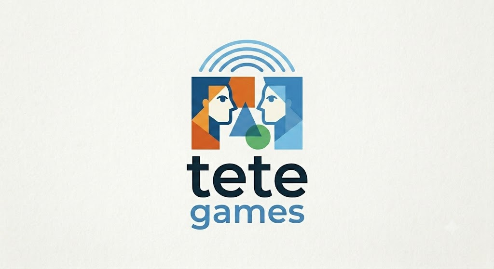
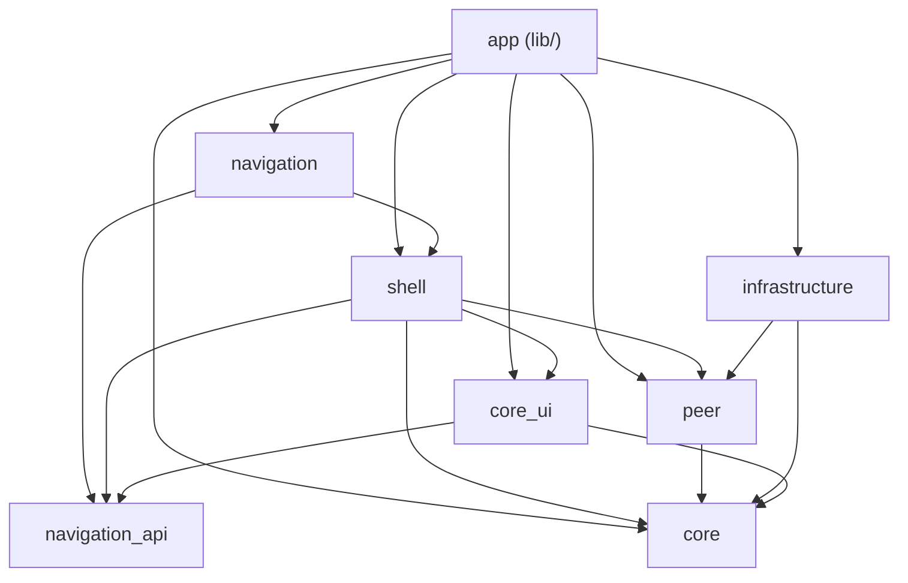
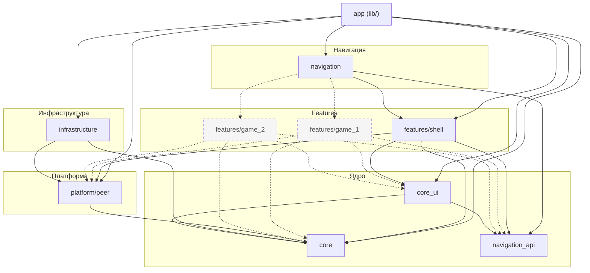

# tete games



Мобильное приложение для офлайн-игр на двоих по Bluetooth Low Energy (BLE).  
**tete games** — переосмысление [ble_games](https://github.com/Viweld/ble_games) на базе [Flutterozavr](https://github.com/Viweld/flutterozavr): Clean Architecture, multi-package workspace и общая дизайн-система в `core_ui`.

## О проекте

Два устройства находят друг друга по BLE, устанавливают соединение и обмениваются игровыми сообщениями — без интернета. Поддерживаются пары Android↔Android, iOS↔iOS и Android↔iOS.

Из предшественника **ble_games** (BaTuGa) уже перенесено или в работе:

- BLE-транспорт (`ble_peer_session`): роли host/client, discovery, flow подключения;
- app shell: splash, home (host/client), заглушка списка игр;
- игровая логика и кодеки peer-сообщений — в планах (крестики-нолики и др.).

В новой кодовой базе:

- **архитектура** — ациклический граф пакетов: `core` / `core_ui` / `infrastructure` / `platform/peer` / `features/*`; Composition Root в `lib/di/`; порт навигации `navigation_api`;
- **состояние** — `flutter_bloc` + effect-based навигация и UI-эффекты;
- **DI** — `injectable` + `get_it` (`appLocator`);
- **UI** — тема, цвета и компоненты из `core_ui` (`AppScaffold`, `ui_kit`: кнопки, инпуты, `AppTextField` и т.д.).

## Статус

| Область | Статус |
|---------|--------|
| Workspace & DI | готово |
| Тема и ui_kit (`core_ui`) | готово (используется подмножество) |
| BLE-транспорт (`infrastructure/peer`, `ble_peer_session`) | готово |
| Splash / Home / список игр | готово |
| Firebase bootstrap (FCM + Crashlytics hooks) | готово (нативная конфигурация + Dart init) |
| Игры (`features/game_*`) | в планах |
| `core_ui` travel widgets cleanup | в планах |

## Архитектура

Проект разделён на **ядро**, **платформу**, **инфраструктуру**, **навигацию** и **feature-пакеты**. Каждая игра — отдельный пакет в `features/<game_name>/`; shell не содержит логику конкретных игр.

```text
lib/di/app_di.dart          Composition Root (единственное место сборки графа DI)
core/                       BLoC-хелперы, локализация, технические порты
core_ui/                    тема, ui_kit
navigation_api/             порт AppNavigator
navigation/                 AppRouter — агрегатор маршрутов shell + игр
infrastructure/             SharedPreferences, Firebase, BLE transport, push
platform/peer/              BLE FSM, frames, PeerConnectionService
features/shell/             splash, home, profile/settings, BLE overlay UI
features/<game_name>/       отдельная игра (domain + presentation + DI)
```

### Текущий граф зависимостей



### Расширение: игровые feature-пакеты

Новые игры подключаются как независимые пакеты. Shell показывает карточки на Home и открывает маршрут игры через `AppRouter`; BLE-overlay остаётся на Home и **не** дублируется в играх.



Сплошные стрелки — существующие зависимости. Пунктир — планируемые (`game_1`, `game_2` — условные имена; первая реальная игра может называться, например, `tictactoe`).

### Правила для игровых пакетов

| Разрешено | Запрещено |
|-----------|-----------|
| `core`, `core_ui`, `navigation_api` | `infrastructure`, корневой `app` |
| `platform/peer` (barrel `peer_connection.dart`, позже `peer_game.dart`) | импорт UI shell или других игр |
| свой `domain` + `presentation` + injectable DI | прямой импорт `ble_peer_session` |
| регистрация маршрутов в `AppRouter` (`// fz:routes`) | зависимость `peer` → игра (platform не знает о features) |

Типичный flow добавления игры:

1. `mason make feature_package --feature_name game_1` → `features/game_1/`.
2. Экран игры + BLoC; обмен ходами через `PeerConnectionService` / контракты `peer_game.dart`.
3. Подключить пакет в workspace (`pubspec.yaml`), `navigation`, DI (`// fz:external-modules`).
4. Добавить `AutoRoute` в `AppRouter` и пункт в grid на Home (shell знает только id/маршрут, не логику игры).

Граф зависимостей проверяется в CI: `fvm dart run tool/check_workspace_graph.dart` (`strict: true`).

## Пакеты workspace

| Пакет | Назначение |
|-------|------------|
| `core/` | `appLocator`, BLoC-хелперы, локализация, технические порты |
| `infrastructure/` | SharedPreferences, Firebase, BLE transport (`ble_peer_session`), push |
| `core_ui/` | тема (`AppTheme`, `AppColors`), `AppScaffold`, `ui_kit` |
| `platform/peer/` | BLE connection FSM, frames, `PeerConnectionService` |
| `navigation_api/` | порт `AppNavigator` |
| `navigation/` | `AppRouter` (реализует `AppNavigator`, агрегирует маршруты) |
| `features/shell/` | splash, home, profile/settings, список игр, BLE connection UI |
| `features/game_*` | отдельная игра — свой domain, экран(ы), DI *(планируется)* |

## Стек

- Flutter 3.41+ / Dart 3.11+
- Bluetooth Low Energy (BLE) через `ble_peer_session`
- `flutter_bloc` + `bloc_concurrency`
- `freezed`, `injectable`, `auto_route`
- `firebase_core`, `firebase_messaging`, `firebase_crashlytics`
- FVM для фиксации версии SDK

## Быстрый старт

```bash
fvm flutter pub get
fvm dart run build_runner build --delete-conflicting-outputs
fvm flutter run
```

## Env

Скопируйте `.env.example` → `.env` при необходимости. Для BLE backend URL не нужен.

## Сборка

```bash
fvm flutter build apk
fvm flutter build ios
```
